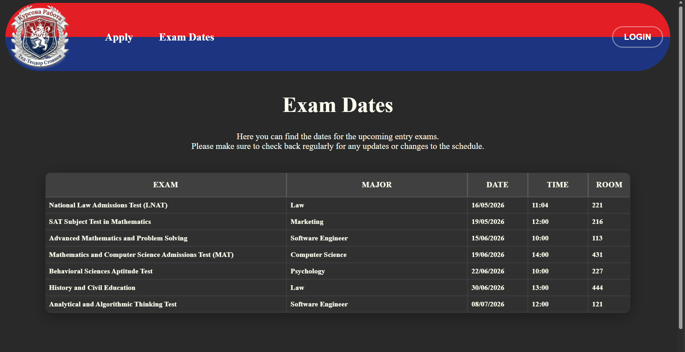
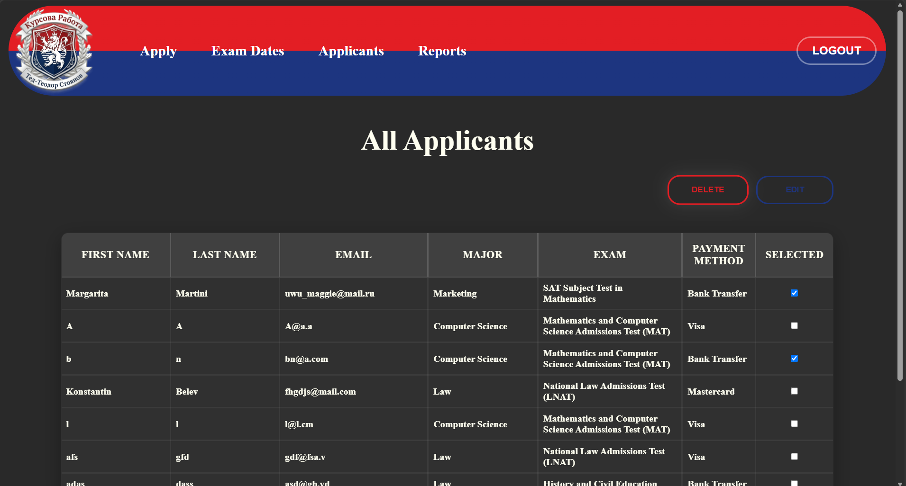
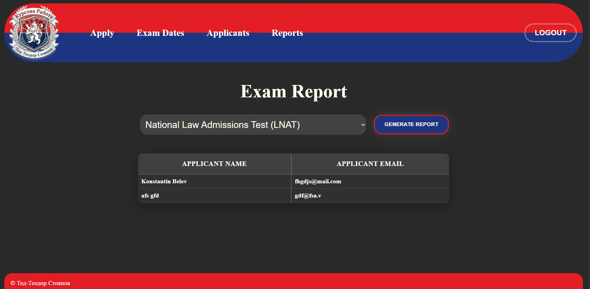

# Entry-Exam

A website for applying to a college's entrance exams, build with HTML, CSS, JavaScript, PHP and XAMPP.

# Used programing languages
HTML and CSS for page formating.

PHP for connecting to the database, and creating sql queries

JavaScript for varrious things such as: 
the Home Page image slider;
Enabling and disabling the "Save" and "Delete" admin buttons if there's no selected data to edit ot delete;
Loading the exams in the apply form after the applicant has choosen a major to stop applicants from choosing an exam before choosing a major;
Showing and hiding the Login Window overlay,

## Index Page

## Apply Page

## Exam Dates Page

## Login Window

## Admin's applicant viewer

## Admin's generated report

## About this project
This project was developed as part of a University Assignment.

Using XAMPP, several SQL tables were created to store data about applicants, exams, majors, and users (administrators). The website connects to the database through PHP, allowing dynamic interaction with the stored data.

Users can apply by filling a form that requires their First Name, Last Name, email, major and exam they want to apply for and the payment method. Only admins are allowed to log in and edit or delete data. Also they can generate reports - one that shows the number of applicants that have applied for a major, and another that shows all applicant's full name and address for a chosen exam. Additionally, the admin's password is hashed.

### How to launch it using VSCode and XAMPP

1. Open XAMPP and star the Apache and MySQL servers
2. Inside the repository there's a "SQL" folder. The file inside contains the database that needs to be imported in XAMPP. In the browser, go to XAMPPS phpMyAdmin page through http://localhost/dashboard/ and find the import option.
3. In VSCode, open the folder containing the files and in the terminal type: php -S localhost:8000
4. Launch the site in the browser with the http://localhost:8000 link.
